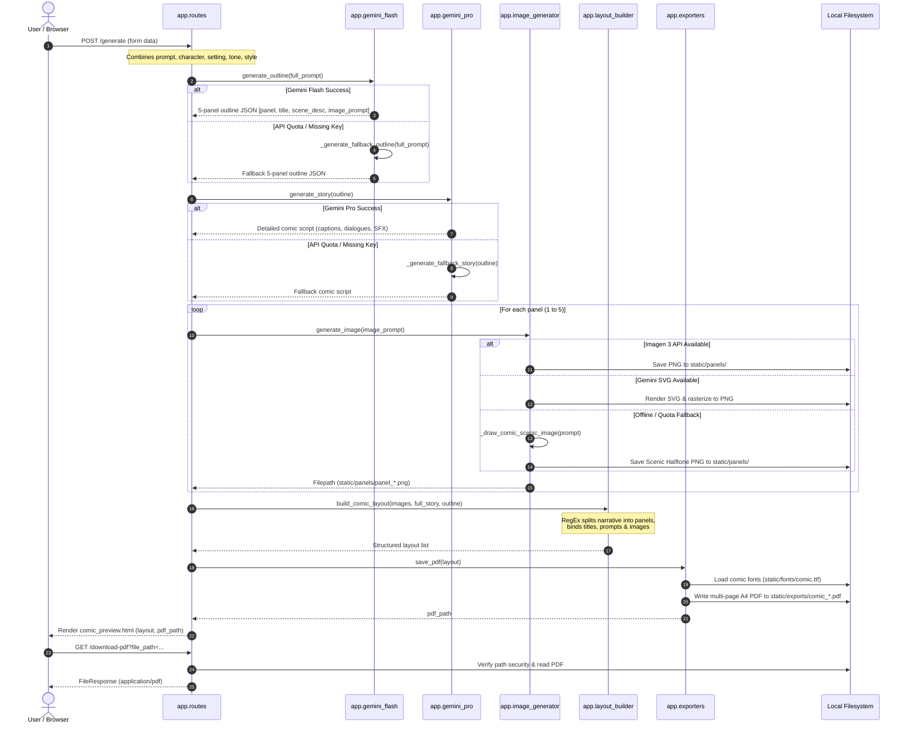

# 🔄 Data Flow Specification

## 1. End-to-End Sequence Diagram



---

## 2. Data Transformation States

### State 1: Raw Ingestion Payload
```json
{
  "prompt": "A brave red fox exploring an enchanted glowing forest",
  "character_name": "Rusty the Fox",
  "setting": "Ancient Whispering Woods",
  "tone": "Wonder and Mystery",
  "style": "Vintage Halftone Comic Book"
}
```

### State 2: Aggregated Master Prompt
```text
A brave red fox exploring an enchanted glowing forest
The main character is Rusty the Fox.
The setting is a Ancient Whispering Woods.
The tone is Wonder and Mystery. The art style is Vintage Halftone Comic Book.
```

### State 3: Outline Representation (`generate_outline`)
```json
[
  {
    "panel": 1,
    "title": "The Journey Begins: Ancient Whispering Woods",
    "scene_description": "Rusty the Fox stands boldly at the threshold...",
    "image_prompt": "Vintage comic book art style, Rusty the Fox arriving at Ancient Whispering Woods..."
  },
  ... (5 items)
]
```

### State 4: Story Script Output (`generate_story`)
```text
**Panel 1: The Journey Begins: Ancient Whispering Woods**
**CAPTION:** The wind howls as our tale unfolds under uncharted skies.
**NARRATION:** Standing at the frontier, determination gleams in every motion.
RUSTY: "No matter what lies ahead, there's no turning back now!"
```

### State 5: Layout Dictionary (`build_comic_layout`)
```json
[
  {
    "panel": 1,
    "title": "The Journey Begins: Ancient Whispering Woods",
    "image_path": "static/panels/panel_Vintage_comic_075f1178_831619.png",
    "text": "**CAPTION:** The wind howls as our tale unfolds...\n**NARRATION:** Standing at the frontier...\nRUSTY: \"No matter what lies ahead...\"",
    "scene_description": "Rusty the Fox stands boldly at the threshold...",
    "image_prompt": "Vintage comic book art style..."
  },
  ... (5 items)
]
```

### State 6: Compiled Document (`save_pdf`)
- Destination: `static/exports/comic_20260928115817.pdf`
- Format: ISO 32000-1 (PDF) document with embedded TTF font streams and high-resolution PNG raster graphics.
