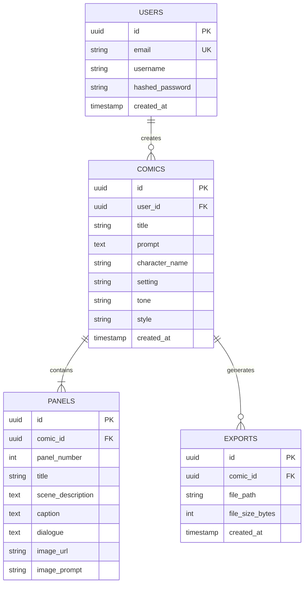

# 🗄️ Database & Storage Design Specification

## 1. Current Active Architecture: File-Based Storage Engine

In the current implementation, ComicCraft utilizes a zero-configuration, high-performance **File-Based Storage Architecture**. This design eliminates database setup overhead, ensures rapid local portability, and keeps asset delivery directly coupled with the static web server.

### Storage Directory Structure

```
d:/comic/static/
├── exports/                 # Compiled Comic PDF Archives
│   ├── comic_20260925102743.pdf
│   ├── comic_20260928115817.pdf
│   └── ...
├── panels/                  # Rendered Comic Panel Illustrations
│   ├── panel_A_brave_red_fox_exploring_075f1178_831619.png
│   └── ...
└── fonts/                   # Embedded Comic Fonts for PDF & UI
    ├── comic.ttf            # Regular Comic Book Font
    ├── comicbd.ttf          # Bold Comic Book Font
    ├── comici.ttf           # Italic Comic Book Font
    └── comicz.ttf           # Bold Italic Comic Book Font
```

### File Naming Specifications
- **PDF Exports**:
  - Format: `comic_{YYYYMMDDHHMMSS}.pdf`
  - Example: `comic_20260928115817.pdf`
  - Generation: Timestamped at moment of compilation to guarantee unique sequential issue naming.
- **Panel Images**:
  - Format: `panel_{clean_prompt}_{prompt_hash}_{timestamp}.png`
  - Sanitization: Replaces non-alphanumeric characters with underscores, appends first 8 chars of MD5 prompt hash and millisecond timestamp.
  - Dimensions: 768px width x 512px height (aspect ratio ~3:2).

### Metadata Indexing Strategy
The Comic Vault (`/all-users` / `/gallery`) indexes stored comics dynamically from disk:
```python
export_files = glob.glob(os.path.join("static", "exports", "*.pdf"))
for f in sorted(export_files, key=os.path.getmtime, reverse=True):
    stat = os.stat(f)
    created_dt = datetime.fromtimestamp(stat.st_mtime).strftime("%b %d, %Y %I:%M %p")
    size_kb = round(stat.st_size / 1024, 1)
```

---

## 2. To be completed: Planned Relational Database Schema (Future Roadmap)

> **Status**: *To be completed* (Planned for Phase 2 multi-tenant authentication and user profile management).
> In the current release, all storage is file-based as documented above. The following schema represents the planned relational architecture for future integration with PostgreSQL / SQLite.



### Planned SQL DDL (Blueprint for Future Migration)

```sql
-- Planned Schema for Future PostgreSQL / SQLite Integration
CREATE TABLE IF NOT EXISTS users (
    id VARCHAR(36) PRIMARY KEY,
    email VARCHAR(255) UNIQUE NOT NULL,
    username VARCHAR(100) NOT NULL,
    hashed_password VARCHAR(255) NOT NULL,
    created_at TIMESTAMP DEFAULT CURRENT_TIMESTAMP
);

CREATE TABLE IF NOT EXISTS comics (
    id VARCHAR(36) PRIMARY KEY,
    user_id VARCHAR(36) REFERENCES users(id) ON DELETE CASCADE,
    title VARCHAR(255) NOT NULL,
    prompt TEXT NOT NULL,
    character_name VARCHAR(100) NOT NULL,
    setting VARCHAR(200) NOT NULL,
    tone VARCHAR(100) NOT NULL,
    style VARCHAR(100) NOT NULL,
    created_at TIMESTAMP DEFAULT CURRENT_TIMESTAMP
);

CREATE TABLE IF NOT EXISTS comic_panels (
    id VARCHAR(36) PRIMARY KEY,
    comic_id VARCHAR(36) REFERENCES comics(id) ON DELETE CASCADE,
    panel_number INT NOT NULL,
    title VARCHAR(255),
    scene_description TEXT,
    caption TEXT,
    dialogue TEXT,
    image_url VARCHAR(500),
    image_prompt TEXT,
    created_at TIMESTAMP DEFAULT CURRENT_TIMESTAMP
);

CREATE TABLE IF NOT EXISTS comic_exports (
    id VARCHAR(36) PRIMARY KEY,
    comic_id VARCHAR(36) REFERENCES comics(id) ON DELETE CASCADE,
    pdf_path VARCHAR(500) NOT NULL,
    file_size_kb FLOAT,
    created_at TIMESTAMP DEFAULT CURRENT_TIMESTAMP
);
```
