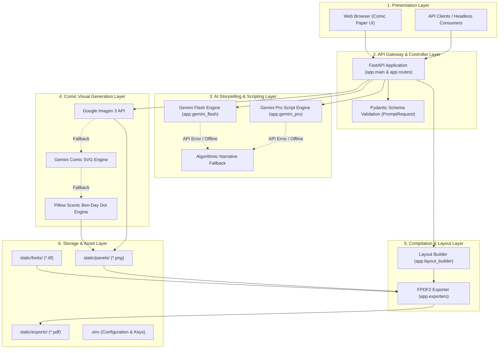

# 🏛️ System Architecture Specification

## 1. Architectural Style & Overview
ComicCraft follows a **Modular Layered Pipeline Architecture** combined with an **Asynchronous REST Gateway**. The architecture isolates user interactions, AI orchestration, image rendering, layout synthesis, and document compilation into decoupled layers.

---

## 2. Detailed Layer Descriptions

### Layer 1: Presentation Layer
- **Components**:
  - `templates/index.html`: Story studio form, preset selectors, API key configuration modal, dynamic loading flipbook.
  - `templates/comic_preview.html`: 5-panel sequential reader with speech bubbles, panel cards, and direct PDF download CTA.
  - `templates/all_users.html`: Comic Vault gallery displaying all generated issues.
  - `templates/export_success.html`: Download celebration confirmation screen.
  - `static/css/comic.css`: Vintage comic paper design system with halftone Ben-Day dot matrix styling.
- **Responsibility**: Rendering responsive, interactive comic pages and capturing creative parameters.

### Layer 2: API Gateway & Controller Layer
- **Components**: `app.main` (FastAPI instance), `app.routes` (APIRouter).
- **Responsibility**: Route dispatching, static asset mounting (`/static`), request parsing, and error handling.
- **Data Validation**: Strict type checking and defaults via Pydantic (`PromptRequest`).

### Layer 3: AI Storytelling & Scripting Layer
- **Components**:
  - `app.gemini_flash.py`: Formulates structured prompt to Gemini Flash; extracts 5-panel JSON breakdown.
  - `app.gemini_pro.py`: Takes the 5-panel breakdown and instructs Gemini Pro to generate rich comic narration, character dialogue, and sound effects.
  - **Fallback Modules**: Built-in regex-based narrative generators that construct customized stories when API keys are absent or rate-limited.

### Layer 4: Comic Visual Generation Layer
- **Component**: `app.image_generator.py`.
- **Pipeline Hierarchy**:
  1. *Imagen 3*: Diffusion generation via Google GenAI SDK or Google AI Studio REST endpoints.
  2. *Gemini SVG*: Generates vector graphic XML and rasterizes it to PNG via ReportLab.
  3. *Pillow Scenic Engine*: Procedural Ben-Day halftone renderer that generates 768x512 PNG illustrations with celestial gradients, mountain/city horizons, character silhouettes, badges, and ink borders.

### Layer 5: Compilation & Layout Layer
- **Components**:
  - `app.layout_builder.py`: Maps panel images, titles, descriptions, and scripted dialogues into a unified data structure.
  - `app.exporters.py`: Uses `fpdf2` and comic TTF fonts to compile the final multi-page A4 PDF document.

### Layer 6: Storage & Asset Layer
- **Components**:
  - `static/panels/`: Local storage for generated panel illustrations.
  - `static/exports/`: Local storage for compiled comic PDFs.
  - `static/fonts/`: Comic book TrueType fonts (`comic.ttf`, `comicbd.ttf`, `comici.ttf`, `comicz.ttf`).
  - `.env`: Environment variables and API credentials.
