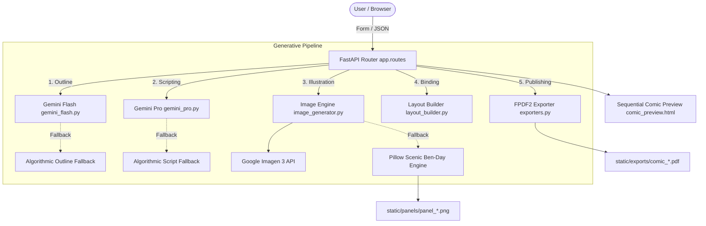

# 💥 ComicCraft — AI Comic Story Creator & Publisher

> **ComicCraft** is an end-to-end, AI-powered sequential comic strip creation and publishing platform. Built with **FastAPI**, **Google Gemini Models** (`gemini-1.5-flash` & `gemini-1.5-pro`), procedural **Ben-Day Halftone Comic Inking**, and **FPDF2**, ComicCraft transforms simple creative prompts into personalized 5-panel comic strips and publication-ready multi-page PDFs.

---

## 🧭 Repository Phase-Wise Lifecycle Structure

The repository is organized phase-wise across the full software engineering lifecycle from ideation to demonstration:

| Phase Directory | Key Documents & Focus |
| :--- | :--- |
| [**01_Brainstorming_and_Ideation_Phase**](file:///d:/comic/01_Brainstorming_and_Ideation_Phase/) | [Problem_Statement.md](file:///d:/comic/01_Brainstorming_and_Ideation_Phase/Problem_Statement.md), [Idea_Description.md](file:///d:/comic/01_Brainstorming_and_Ideation_Phase/Idea_Description.md), [Proposed_Solution.md](file:///d:/comic/01_Brainstorming_and_Ideation_Phase/Proposed_Solution.md), [Brainstorming_Notes.md](file:///d:/comic/01_Brainstorming_and_Ideation_Phase/Brainstorming_Notes.md) |
| [**02_Requirement_Analysis_Phase**](file:///d:/comic/02_Requirement_Analysis_Phase/) | [Functional_Requirements.md](file:///d:/comic/02_Requirement_Analysis_Phase/Functional_Requirements.md), [Non_Functional_Requirements.md](file:///d:/comic/02_Requirement_Analysis_Phase/Non_Functional_Requirements.md), [User_Requirements.md](file:///d:/comic/02_Requirement_Analysis_Phase/User_Requirements.md), [System_Requirements.md](file:///d:/comic/02_Requirement_Analysis_Phase/System_Requirements.md), [Use_Cases.md](file:///d:/comic/02_Requirement_Analysis_Phase/Use_Cases.md) |
| [**03_Project_Design_Phase**](file:///d:/comic/03_Project_Design_Phase/) | [System_Architecture.md](file:///d:/comic/03_Project_Design_Phase/System_Architecture.md), [Database_Design.md](file:///d:/comic/03_Project_Design_Phase/Database_Design.md), [UI_UX_Design.md](file:///d:/comic/03_Project_Design_Phase/UI_UX_Design.md), [Data_Flow.md](file:///d:/comic/03_Project_Design_Phase/Data_Flow.md), [Architecture_Diagrams/](file:///d:/comic/03_Project_Design_Phase/Architecture_Diagrams/) |
| [**04_Project_Planning_Phase**](file:///d:/comic/04_Project_Planning_Phase/) | [Development_Plan.md](file:///d:/comic/04_Project_Planning_Phase/Development_Plan.md), [Project_Timeline.md](file:///d:/comic/04_Project_Planning_Phase/Project_Timeline.md), [Task_Breakdown.md](file:///d:/comic/04_Project_Planning_Phase/Task_Breakdown.md), [Technology_Stack.md](file:///d:/comic/04_Project_Planning_Phase/Technology_Stack.md) |
| [**05_Project_Development_Phase**](file:///d:/comic/05_Project_Development_Phase/) | [source/](file:///d:/comic/05_Project_Development_Phase/source/), [frontend/](file:///d:/comic/05_Project_Development_Phase/frontend/), [backend/](file:///d:/comic/05_Project_Development_Phase/backend/), [api/](file:///d:/comic/05_Project_Development_Phase/api/), [database/](file:///d:/comic/05_Project_Development_Phase/database/), [config/](file:///d:/comic/05_Project_Development_Phase/config/), [development_notes.md](file:///d:/comic/05_Project_Development_Phase/development_notes.md) |
| [**06_Project_Testing_Phase**](file:///d:/comic/06_Project_Testing_Phase/) | [Test_Plan.md](file:///d:/comic/06_Project_Testing_Phase/Test_Plan.md), [Test_Cases.md](file:///d:/comic/06_Project_Testing_Phase/Test_Cases.md), [Test_Results.md](file:///d:/comic/06_Project_Testing_Phase/Test_Results.md), [Bug_Reports.md](file:///d:/comic/06_Project_Testing_Phase/Bug_Reports.md), [screenshots/](file:///d:/comic/06_Project_Testing_Phase/screenshots/) |
| [**07_Project_Documentation_Phase**](file:///d:/comic/07_Project_Documentation_Phase/) | [User_Guide.md](file:///d:/comic/07_Project_Documentation_Phase/User_Guide.md), [Installation_Guide.md](file:///d:/comic/07_Project_Documentation_Phase/Installation_Guide.md), [API_Documentation.md](file:///d:/comic/07_Project_Documentation_Phase/API_Documentation.md), [Deployment_Guide.md](file:///d:/comic/07_Project_Documentation_Phase/Deployment_Guide.md), [Troubleshooting.md](file:///d:/comic/07_Project_Documentation_Phase/Troubleshooting.md) |
| [**08_Project_Demonstration_Phase**](file:///d:/comic/08_Project_Demonstration_Phase/) | [Project_Demo.md](file:///d:/comic/08_Project_Demonstration_Phase/Project_Demo.md), [Demo_Steps.md](file:///d:/comic/08_Project_Demonstration_Phase/Demo_Steps.md), [Screenshots/](file:///d:/comic/08_Project_Demonstration_Phase/Screenshots/), [Demo_Video_Link.md](file:///d:/comic/08_Project_Demonstration_Phase/Demo_Video_Link.md) |

---

## 🏛️ System Architecture



---

## 🎨 UI Aesthetic: Authentic Comic Paper & Ben-Day Halftone Dots

- **Newsprint Pulp Paper Texture**: Warm parchment tones (`#faf6ea`) and radial Ben-Day dot gradients.
- **Bold Black Ink Borders & 4-Color Drop Shadows**: Tactile pop-art comic shadows (`6px 6px 0px #18181b`).
- **Authentic Comic Typography**: Featuring Google Fonts (`Bangers`, `Comic Neue`, `Permanent Marker`, `Outfit`).
- **Classic Accents**: Action starburst bubbles (`POW!`, `BAM!`), Comics Code Authority approval stamps (`★ CODE APPROVED ★`), and yellow speech/dialogue boxes.

---

## 🚀 Key Features & Capabilities

1. **5-Panel Storyboard Outliner (`gemini_flash.py`)**: Converts natural language ideas into structured 5-panel narrative arcs.
2. **Atmospheric Scripting & Dialogue Writer (`gemini_pro.py`)**: Scripts captions, dialogues, and sound effects (*POW!*, *CRACK!*).
3. **Triple-Tier Comic Inking Engine (`image_generator.py`)**: Imagen 3 ──► Gemini SVG ──► Native Pillow Procedural Halftone Scenic Inking Engine with 100% offline uptime.
4. **Layout Aggregator (`layout_builder.py`)**: Seamlessly binds artwork, dialogues, and panel metadata.
5. **Publication-Ready PDF Exporter (`exporters.py`)**: Compiles A4 multi-page comic books with custom comic TrueType fonts (`comic.ttf`, `comicbd.ttf`).
6. **Comic Vault Archive Gallery (`/all-users`, `/gallery`)**: Centralized archive of past generated comic issues with timestamps and download links.
7. **Interactive REST API (`/generate-comic/json`)**: Headless automation endpoints with full Swagger UI documentation at `/docs`.

---

## 🏃 Quick Start: Running Locally

### 1. Prerequisites
- Python 3.10, 3.11, or 3.12 (Active: Python 3.12.10).
- Pip package manager.

### 2. Setup & Installation
```bash
# Clone or navigate to the repository
cd d:/comic

# Install dependencies
pip install -r requirements.txt

# Configure environment variables (optional; fallback works out-of-the-box)
copy .env.example .env
```

### 3. Launch the Application
```bash
# Run via root launcher
python run.py

# Or via Uvicorn
uvicorn app.main:app --reload --host 127.0.0.1 --port 8000
```

- **Web Application Studio**: [http://127.0.0.1:8000](http://127.0.0.1:8000)
- **Interactive Swagger Documentation**: [http://127.0.0.1:8000/docs](http://127.0.0.1:8000/docs)
- **Comic Vault Archive**: [http://127.0.0.1:8000/all-users](http://127.0.0.1:8000/all-users)

---

## 🧪 Automated Testing

Run the automated test suite covering unit, integration, and security checks:
```bash
python 06_Project_Testing_Phase/test_suite.py
```
**Results**: 9 out of 9 tests passing (100% pass rate in ~4.5 seconds).

---

## 🐳 Docker Deployment

```bash
# Build & run with Docker Compose
docker compose up -d
```
Visit [http://localhost:8000](http://localhost:8000).
